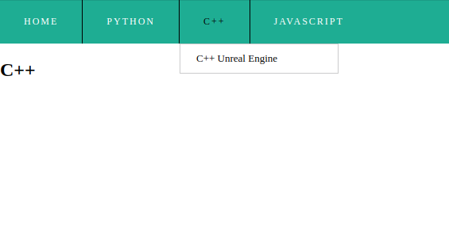
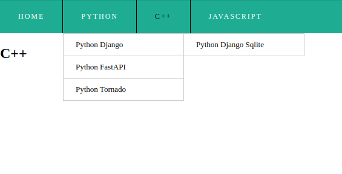

# Simple Tree Menu only on Django

Test task: [document](https://docs.google.com/document/d/1XTnbcXhejyGB-I2cHRiiSZqI3ElHzqDJeetwHkJbTa8)


Installation
------------

#### Clone a repository

```
git clone https://github.com/vadushkin/DjangoTreeMenu.git
```

#### Change a folder

```
cd DjangoTreeMenu
```

#### Venv

Windows:

```shell
python -m venv venv
.\venv\Scripts\activate
pip install --upgrade pip
pip install -r requirements.txt
```

Linux:

```shell
python3 -m venv venv
source venv/bin/activate
pip3 install --upgrade pip
pip3 install -r requirements.txt
```

#### Poetry

```
poetry install
poetry shell
```

#### Create ```.env``` file or delete ```.example``` from ```.env.example```

#### Example to fill in

```dotenv
# Backend/Django
SECRET_KEY=BANANA!
DEBUG=1
ALLOWED_HOSTS=localhost,127.0.0.1
```

Run
---

### Docker

```
docker-compose up --build
```

```
docker-compose stop
```

### Python

```
python manage.py runserver
```

Examples
--------

#### I left some examples for you:

```app_menu/urls.py```

```python
urlpatterns = [
    # Home Page
    path('home/', home_page, {'name': 'Home'}, name='home'),

    # Python Pages
    path('python/', home_page, {'name': 'Python'}, name='python'),
    path('python/django/', home_page, {'name': 'Python Django'}, name='python_django'),
    path('python/fastapi/', home_page, {'name': 'Python FastAPI'}, name='python_fastapi'),
    path('python/tornado/', home_page, {'name': 'Python Tornado'}, name='python_tornado'),
    path('python/django/sqlite', home_page, {'name': 'Python Django Sqlite'}, name='python_django_sqlite'),

    # C++ Pages
    path('cpp/', home_page, {'name': 'C++'}, name='cpp'),
    path('cpp/unreal_engine/', home_page, {'name': 'C++ Unreal Engine'}, name='cpp_unreal_engine'),
    ...
]
```

### Screenshots



